# Executive Summary

AI-generated text on social media and in content often follows a **distinctive style**. Compared to human writing, AI text tends to be **uniform, formal, and patterned**. Common “tells” include overused corporate buzzwords (e.g. _“empower,” “leverage,” “delve”_), cliché phrases (_“in today’s fast-paced world”_), repetitive sentence structures (rule-of-three lists, one-idea-per-line), and formulaic discourse moves (e.g. contrarian hooks, scripted conclusions). These features arise because LLMs predict high-probability tokens from their training data rather than expressing an individual voice. For example, a 2026 study finds AI text has **low perplexity and burstiness** – i.e. predictable word choices and uniform sentence length. In practice this means AI writing often uses identical opening templates (e.g. **“Most people think X… Here’s why.”** on LinkedIn), stock hedging and filler phrases (like _“Here’s the thing”_, _“Let that sink in”_), and very neat, well-organized paragraphs and lists. Analyzing thousands of posts and papers confirms these trends: AI text is rich in nouns and formal verbs, repeats a small set of patterns, and often lacks personal or creative touches. This report presents a **taxonomy of these patterns** with examples from LinkedIn, Twitter (X), Reddit, blogs, emails, YouTube scripts, etc. For each pattern we define it, give platform-specific examples, estimate how common it is, explain why models do it (training bias, prompt style), and suggest regex-like heuristics to flag it. We also propose ways to “humanize” AI text (e.g. vary vocabulary, add personal anecdotes, break rigid templates). Tables summarize the **top recurring phrases and structures** (ranked by frequency), and a mermaid diagram outlines the taxonomy of pattern types. The goal is a rigorous cross-platform guide to AI writing artifacts so educators and developers can detect and correct them.

_Figure: Timeline of PubMed search hits for the word “delve,” showing a sharp surge after 2022 – reflecting how GPT-4–era models popularized this term._

## Pattern Taxonomy

The chart below organizes common AI-writing artifacts into categories. Most fall into **lexical** (word-level), **syntactic** (sentence-level), **discourse** (paragraph/flow), **rhetorical/tone**, and **structural** patterns.

```mermaid
graph TD
    AI[AI Writing Patterns] --> Lexical
    AI --> Syntactic
    AI --> Discourse
    AI --> Rhetorical
    AI --> Structural
    Lexical --> Buzzwords["Buzzwords & Jargon"]
    Lexical --> Cliches["Cliché Phrases"]
    Lexical --> Fillers["Filler/Hedging Phrases"]
    Syntactic --> Templates["Sentence Templates"]
    Syntactic --> Lists["List/Bullet Structures"]
    Syntactic --> Connectives["Repeated Transitions"]
    Discourse --> Openers["Formulaic Openers"]
    Discourse --> Conclusions["Scripted Conclusions"]
    Discourse --> CTAs["Standard CTAs & Closings"]
    Rhetorical --> FormalTone["Overly Formal Tone"]
    Rhetorical --> Positivity["Excessive Positivity"]
    Rhetorical --> Repetition["Self-Repetition"]
    Structural --> Paragraphs["Uniform Paragraphs"]
    Structural --> Formatting["One-Sentence Lines"]
```

Each category contains many patterns (e.g. “Buzzwords” includes words like _“crucial,” “significant,” “elevate,” “insights”_, etc.). The rest of this report details these patterns with examples and metrics.

## Lexical Patterns (Words & Phrases)

**Definition:** AI text often reuses a small vocabulary of “stock” words/phrases much more than humans do. These include high-level abstract nouns/adjectives (e.g. _“nuance,” “quest,” “holistic,” “seamless,” “pivotal”_), corporate buzzwords (_“empower,” “unlock,” “foster,” “leverage”_), and common filler expressions (_“additionally,” “furthermore,” “in conclusion”_). A 2026 linguistic survey confirms AI text has **formally toned diction and lower lexical diversity**. For example, AI is **182× more likely** than human text to use the phrase _“play a significant role in shaping”_, and 107× more likely to say _“in today’s fast-paced world”_. Similarly, one LinkedIn analysis found phrases like _“Here’s the thing”_ and _“Let that sink in”_ in 34% and 28% of AI-posts, rates ~20–30× higher than normal writing.

- **Example (LinkedIn):** “Most people think X. They’re wrong.” (Contrarian opener with stock phrasing).
- **Example (Email):** “I hope this email finds you well” (greeting).
- **Frequency:** Many of these words appear in a large fraction of AI-generated posts. For instance, “Here’s the thing” shows up in ~1/3 of sampled AI LinkedIn posts.
- **Cause:** LLMs optimize for high-probability phrasing from web data, so overly generic/safe terms get repeated. Training often includes marketing and news corpora full of these words. Reinforcement learning can further amplify cliched phrases.
- **Detection (heuristic):** Scan text with a regex for these terms. For example: `\b(delve|tapestry|nuance|empower|insights|foster|crucial|significant|game-changer|here['’]s the thing|let that sink in|full stop|in today['’]s fast-paced|play a significant role)\b`. A high count or unexpected frequency of such terms flags likely AI origin. Low lexical diversity metrics (e.g. type-token ratio) can also signal AI text.
- **Mitigation:** Replace cliché buzzwords with more precise or varied language. Use idioms or phrasal verbs instead of abstract nouns (“write” instead of “articulate insights”). Limit recycled “viral” phrases. Humans can inject more slang, anecdotes or first-person perspective (e.g. _“Honestly,” “By the way,” “I feel…”_) to break the pattern.

**Table: Selected Overused AI Phrases (AI vs. Human frequency)**

| Phrase / Pattern                       | Typical Context             | Relative Frequency                 | Source (Platform) |
| -------------------------------------- | --------------------------- | ---------------------------------- | ----------------- |
| _“Play a significant role in shaping”_ | Formal/professional writing | 182× more in AI than human         | (General)         |
| _“Notable works include”_              | Academic/biographical       | 120× more in AI than human         | (General)         |
| _“In today’s fast-paced world”_        | Articles/introductory       | 107× more in AI than human         | (General)         |
| _“Here’s the thing”_                   | Social media posts          | Found in ~34% of AI LinkedIn posts | (LinkedIn)        |
| _“Let that sink in”_                   | Social media posts          | ~28% of AI posts (28× human rate)  | (LinkedIn)        |
| _“Game-changer”_                       | Posts/tweets/headlines      | ~19× human rate                    | (LinkedIn)        |
| _“Aims to explore”_                    | Blog introductions          | ≥50× more in AI                    | (General)         |
| _“And honestly?”_                      | Casual opinions             | ~15× human rate                    | (LinkedIn)        |
| _“Full stop.”_                         | Emphatic statements         | ~14× human rate                    | (LinkedIn)        |
| _“The truth is”_                       | Emphatic statements         | ~12× human rate                    | (LinkedIn)        |
| _“Aligns”_ (as verb)                   | Corporate speak             | ~16× more in AI                    | (General)         |
| _“Showcasing”_                         | Advertising/copywriting     | ~20× more in AI                    | (General)         |

## Syntactic Patterns (Sentence Structures)

**Definition:** AI tends to favor a handful of sentence and clause patterns. Typical templates include the “rule of three” (listing three elements: _“X, Y, and Z”_), **parallel constructions** (e.g. _“not only X but also Y”_, _“no X, no Y, just Z”_), and stacked explanatory clauses. AI outputs often use lengthy, complex sentences with multiple subordinate clauses, and repeatedly employ em-dashes for asides. By contrast, humans mix simple and complex sentences more variably.

- **Example (Structuring):** ChatGPT often breaks text into bullet-like single-sentence lines, especially on LinkedIn or blogs. In a study of 500 AI-written LinkedIn posts, **91%** used one sentence per paragraph, each followed by a blank line (for example: _“This is point one._ _  
  This is point two. This is point three.”_).
- **Example (Templates):** Common AI sentence formats include: “It is important to note that…”, “It’s not just X. It’s also Y.” (contrastive pair), and “Here’s why…” constructions. For instance, _“It’s not just about X; it’s also about Y.”_ or _“Here’s why that matters…”_ appear frequently in AI text. These mirror bullet-point lists disguised in prose.
- **Frequency:** These templates recur constantly. For example, the LinkedIn study reported **82%** of AI posts began with one of three stock structures (contrarian hook, humble-brag confession, or bold one-liner). Another indicator is the overuse of **em-dashes** – AI will insert clauses with “—” as dramatic pauses, whereas semicolons and parentheses are rare.
- **Cause:** LLMs learn syntax by pattern-probability. Trained on encyclopedic and marketing text, they often default to perfectly grammatical, complex sentences (avoiding fragments or run-ons), aligning with their training. Because they “play it safe,” they copy repeated syntactic patterns seen in data (e.g. listicles and formal writing have those templates).
- **Detection (heuristic):** Algorithms can parse sentence structures. For instance, flagging paragraphs with **>80% single-sentence lines** or regex for patterns like `^[Nn]ot only .* but (also)?.*` or `^[Nn]o [^,]+, no [^,]+, just .*` catches formulaic structures. Counting transitions can catch patterns like “In summary,” or “It is important to note” at sentence starts. Low variance in sentence length (few short sentences) also signals AI (high “burstiness” = low AI, so low burstiness = AI).
- **Mitigation:** Vary sentence length and structure deliberately. Mix short, simple sentences and occasional fragments with complex clauses. Use semicolons or bullets when listing to avoid unnatural runs. Introduce sentence “breaks” (e.g. starting a sentence with _But_, _And_, or an anecdote). Randomly place conjunctions or ellipses to simulate human-like uneven rhythm.

## Discourse Moves (Openers, Transitions, CTAs)

**Definition:** AI writing often follows predictable discourse-level patterns: set openings, connective phrases, and closings. Because LLMs mimic formal writing guides, they tend to use generic **openers** (hooks) and **closers** (conclusions/CTAs). Human writing is more context-tailored and less formulaic.

- **Openers:** On social media, AI posts frequently start with a “contrarian hook” (e.g. _“Most people think… They’re wrong.”_), a “humble-brag confession” (e.g. _“I [achieved X]. But here’s the truth about Y.”_), or a bombshell statistic. On LinkedIn specifically, 82% of AI posts used one of three standard openers. On Twitter/X, AI might start threads with a startling fact or rhetorical question. In email, standard salutations like _“I hope you’re doing well”_ or _“Dear [Name],”_ are used.
- **Transitions:** AI often relies on a small set of formal transition words. Phrases like _“however,” “moreover,” “additionally,” “on the other hand,”_ and _“in summary”_ appear repeatedly. For example, Grammarly notes AI tends to write with **“very organized paragraphs”** and list-like structure, often using _“In conclusion”_ or _“Overall,”_ at section ends.
- **Conclusions/CTAs:** AI text frequently ends with a neat summary and call-to-action. A typical closing might start with _“In conclusion,”_ or _“Overall,”_ followed by restating the main points. Emails often close with _“Thank you for your time. Let me know if you have any questions.”_ (almost boilerplate language). On social media or blogs, AI will add **CTAs** like _“Please share or comment”_ or _“Follow for more insights”_. In YouTube scripts, AI tends to insert a subscription CTA (e.g. _“Don’t forget to like and subscribe!”_).
- **Examples:** A LinkedIn AI post might conclude: _“Overall, this story demonstrates the importance of resilience and innovation. Let me know your thoughts!”_ (formal summary + explicit engagement prompt). Email AI “sign-offs” often use _“Best regards,” “Kind regards,”_ or _“Sincerely,”_ followed by a name. These polite closings are common to the point of cliché. The Grammarly guide notes **“I hope this email finds you well”** is now a recognizably overused AI-generated opener.
- **Frequency:** Very high. For instance, Pangram Labs found AI essays almost always have a long conclusion that restates prior points and starts with a summarizing phrase. The LinkedIn study found certain CTA phrases (“Here’s the thing,” “And honestly,” etc.) in over 50% of AI posts.
- **Cause:** Models are often prompted or trained to be polite and “helpful,” so they over-emphasize completeness (adding intros and conclusions) and politeness formulas. Many training documents end with summary paragraphs and signatures, so AI mimics that.
- **Detection:** Look for overly formulaic openers/closes. Regex examples: `^(In (summary|conclusion|closing|the end),)` or `^(Overall,|Finally,)`, and for CTAs: `(Let me know|Thank you for (your time|reading)|Follow us)`. Detect one-sentence-per-line format by checking for frequent single-sentence paragraphs. High density of question marks or commands (subscribe/comment prompts) can mark social media AI.
- **Mitigation:** Encourage varied openings. For hooks, use a unique anecdote or direct statement (“This happened to me…”). Transition naturally (“By the way,” “Speaking of which,”). Human authors often skip formal summary and sign-offs or vary them: use casual sign-offs (“Cheers,” “Catch you later”). Avoid starting conclusions with _“In summary”_—try less uniform phrasing. Omit needless “I hope…” greetings when context allows; instead reference recent events or personal context.

## Rhetorical Devices and Tone

**Definition:** AI writing exhibits certain stylistic and rhetorical **tics**. The tone is usually **highly formal, earnest, and positive**. Rhetorically, AI favors “three-part lists,” metaphors, and enthusiastic intensifiers (but ironically avoids colloquial or emotional language). It also overuses qualifying adverbs/adjectives. This results in an unnatural voice that often sounds like a generic expert, not a real person.

- **Formality & Positivity:** AI-generated text is generally more _formal and impersonal_. It rarely uses contractions (“don’t,” “we’ve”) and avoids slang or humor by default. AI tends to be **overly positive** or diplomatic, often phrasing criticism as “advantages and disadvantages” without taking a stand. It also will often include vacuous disclaimers or fluff like _“It is imperative to…”_, _“One key thing to remember is…”_.
- **Qualifiers & Hedging:** Many sentences are padded with intensifiers and hedges: _“very,” “extremely,” “highly,” “truly,”_ or _“in fact,” “indeed,” “ultimately.”_ For example, AI might write _“extremely important,” “truly revolutionary,”_ or _“ultimately, this leads to…”_. A buzzword is _“empower”_, used as in _“This will empower you to…”_. These add a promotional or “grand” tone.
- **Repetition:** AI often **repeats** concepts and words within one text. Phrases introduced in the introduction or body reappear in the conclusion almost verbatim. This is due to the model echoing the prompt or earlier sentences. It may also restate the prompt back to the user.
- **Examples:** ChatGPT-written essays have been noted to employ more complex clauses than human essays: a survey found **~75%** of GPT sentences were compound/complex versus ~50% of student writing (Gibbs). AI is also prone to fill paragraphs with filler sentences (_“Furthermore, … Additionally, …”_) without adding new information. On Reddit, AI-generated posts often use a detached tone: _“I think that [topic] is very important.”_ instead of a personal story or humor.
- **Academic Findings:** Research on student essays shows ChatGPT text can have _higher lexical and syntactic complexity_ but _worse readability_. In other words, it uses rarer words and longer sentences, making it harder to read. This matches the “overly formal” pattern. The same study reports ChatGPT falls short on pragmatic appropriateness – it sounds less natural or engaging.
- **Detection:** Metrics can quantify these: unusually low use of first-person pronouns, high incidence of advanced vocabulary, and long average sentence length hint at AI. A text with few contractions and passive voice frequency spikes could be AI. Checking phrase repetition (n-gram overlap) between sections also flags AI.
- **Mitigation:** To humanize tone, add personal touches: first-person pronouns, anecdotes, humor, or mild opinion. Use contractions and colloquial phrases (_“I’ll” instead of “I will,” “quite a bit” instead of “significantly”). Vary intensity: replace some _“very X”_ with _“pretty X”\* or remove it. Deliberately break strict grammar (start a sentence with “And” or use a sentence fragment) – human writers do this casually. Inject a single emotive word or lowercase interjection (“Wow,” “Hey,” “just saying”) in appropriate genres.

## Genre and Platform Patterns

AI writing artifacts also vary by **platform and genre**. Below we highlight notable patterns on each:

- **LinkedIn Posts:** AI-written LinkedIn content is dominated by narrative/case-study style with motivational tone. Key patterns include:

  - **Contrarian Hooks, Humble Brags, Shock Intros:** As cited, 82% of AI posts used one of three opening templates. Examples: _“Most people think success means X. They’re wrong.”_ or _“I did [impressive thing]. But here’s what nobody tells you about Y.”_ (Humble-brag + revelation). 18% of posts that **didn’t** use these templates outperformed others by feeling more authentic.
  - **Bullet-List Paragraphs:** One-sentence-per-line formatting is extremely common (91% of AI posts). This creates a staccato rhythm (esp. on mobile).
  - **“Permission” Phrases:** Phrases like _“Here’s the thing,” “Let that sink in,” “Read that again,”_ and _“And honestly?”_ appear in 73% of AI posts. These are filler conversational markers that AI tools have learned from viral posts.
  - **Buzzwords:** Words like _“game-changer,” “unleash,” “empower”_ appear often.
  - **CTAs:** AI posts frequently end with invitations (“Let me know what you think” or “Follow for more insights”).
  - **Example:** A typical AI LinkedIn post might read: _“Here’s the thing: success isn’t about luck. It’s about building resilience. In today’s world, everyone is racing, but few recognize the small wins. I know this because [story]. In summary, remember that your journey matters. Let me know if you agree!”_ All features above appear here.

- **Twitter/X Threads:** AI tends to generate X content in micro-thread formats:

  - **Bite-sized Facts:** AI often starts with a bold statement or stat, then elaborates in numbered replies or bullet tweets. E.g. _“Scientists discovered X is Y% more effective…”_ followed by _“Here’s why it matters: …”_.
  - **Hashtags and Mentions:** It may overuse generic hashtags (#innovation, #AI, #productivity) and tag broad accounts.
  - **Engagement Hooks:** Questions like _“Did you know…?”_ or CTAs “Retweet if you agree” may appear.
  - **Limitation:** Twitter’s brevity can actually camouflage AI style somewhat, but repetition of filler words and uniform sentence structure still show up across tweet chain. (No specific study was found, but observations align with general AI style as above.)

- **Reddit Comments/Posts:** AI on Reddit often writes in an overly formal tone for the subreddit context:

  - **Scaffolding Posts:** For “Ask Me Anything” or advice threads, AI uses numbered steps or lists (“1. First…, 2. Second…”).
  - **General Advice Tone:** Replies sound like encyclopedia entries, e.g. _“In my opinion” or “One important thing to remember is…”_.
  - **Lack of Slang:** Rarely uses internet slang or humor unless prompted.
  - **Meta-Style:** Sometimes AI reveals its “advice-giver” persona (e.g. _“As a large language model…”_ if prompted).
  - **Pattern:** Long, well-structured answers with citations (sometimes fictitious) are typical.

- **Tech Blogs / dev.to / Personal Blogs:**

  - **Listicles & Tutorials:** AI often writes list-based tutorials (“Top 5 ways to…”), complete with headings.
  - **Code and Explanations:** On dev.to or programming blogs, AI may insert code blocks or detailed step-by-step breakdowns. It tends to explain concepts from first principles, with generic examples (e.g. “Imagine a function that…”) rather than personal anecdotes.
  - **Generic Intros:** Phrases like _“In this tutorial, we will…”_ or _“Let’s dive in…”_ appear often.
  - **SEO Keywords:** It may overuse terms for SEO (e.g. repeating “how to use X”).

- **YouTube Video Scripts:**

  - **Hook/Introduction:** AI scripts use proven formulas (emotional hook + problem teaser). E.g. _“Are you struggling with X? Well, today we’re diving into…”_.
  - **Section Structuring:** Clear segments (intro, body, conclusion) with verbal transitions (“Next, we’ll talk about…”).
  - **Calls to Action:** Explicit _“Like and subscribe!”_ or _“Click the link below.”_ often appear (especially if the prompt asked for it).
  - **Conversational Tone:** Many guides advise ChatGPT to use a “conversational tone, humor, idioms” for scripts. If followed, it may reduce the stiltedness, but without such instructions AI scripts risk sounding robotic.
  - **Scripting Template:** Prompts often yield a detailed outline (hook, problem, explanation, CTA); raw AI outputs can be reused verbatim if not edited.
  - (No direct study was cited, but these patterns mirror professional scriptwriting prompts.)

- **Emails:**
  - **Greetings & Closings:** As noted, _“I hope this finds you well”_, _“Thank you for…”_, _“Best regards,”_ are all very common in AI-generated emails.
  - **Polite Tone:** The language is often extremely polite and professional, even if the context is casual.
  - **Formality Bias:** AI defaults to American-English norms (uses Oxford commas, standard business letter style) and almost never makes typos or grammar mistakes.
  - **Structure:** Emails have neat paragraphs of equal length, with a one-sentence greeting/closing and a clearly signposted conclusion.
  - **Examples:** _“Dear Dr. Smith, I hope this email finds you well. I am writing to discuss… Thank you for your time. Best regards, [Name].”_ – most lines could have been written by ChatGPT given such a prompt.

## Common Artifacts and Errors

Certain recurring **flaws** betray AI origin:

- **Excessive Repetition:** AI often repeats exact phrases or ideas within one text. Besides reiterating conclusions, it might even duplicate entire sentences verbatim. Checking for duplicate n-grams can catch this.
- **Overuse of Qualifiers:** Look for _“very,” “extremely,” “absolutely,” “truly,” “massively,”_ etc. Human writers tend to be more judicious; AI will amplify statements ("absolutely imperative").
- **Verbose Padding:** AI can be wordy, adding extra background or generic filler. Statements like _“It is important to note that”_ or _“One thing to consider”_ pad content without adding facts.
- **Lack of Specificity:** AI avoids proper nouns/real details unless prompted; it uses vague terms (_“the company,” “the person,” “some time ago”_).
- **Perfection:** Grammatical perfection (no fragments, run-ons, or paragraph variety) can be unnatural. Real writing often has at least one minor issue or an unfinished thought.
- **Continuity Errors:** Sometimes AI references “the above” or “as mentioned earlier” when no previous content exists.

These errors are consequences of model behavior: maximizing fluency often hurts natural variation.

**Detection Heuristics:** In addition to the regex patterns above, broader statistical measures help:

- **Perplexity/Burstiness:** As SearchAtlas explains, AI text has low perplexity (high predictability) and low burstiness (uniform sentence length). Tools compute these metrics.
- **Stylistic Classifiers:** Tools like GPTZero use lists of flagged terms (as seen above) and machine learning on syntax.
- **Metadata Checks:** Irregular timestamps (if scraped), or all text being similarly polished, can hint at generation.

**Mitigation:** To “humanize” text, deliberately break these patterns. Use synonyms instead of common fillers; shorten some sentences; insert rare colloquialisms; vary paragraph lengths; add minor typos or slang. Mentioning personal experiences or vivid details can also counteract AI blandness.

## Pattern Frequency Comparisons

The table below compares some of the **top recurring patterns** across platforms, with indicative frequencies or relative rates. (These figures come from our data analysis and cited studies; in practice they vary by sample and prompt.)

| Pattern / Phrase                                                    | Example/Context                | Frequency (AI vs Human)                | Source (Platform) |
| ------------------------------------------------------------------- | ------------------------------ | -------------------------------------- | ----------------- |
| **“Here’s the thing”**                                              | LinkedIn intro                 | ~34% of AI posts (1/3)                 | LinkedIn          |
| **“Let that sink in”**                                              | LinkedIn emphasis              | ~28% of AI posts                       | LinkedIn          |
| **“Game-changer”**                                                  | Business/marketing post        | ~19× human rate                        | LinkedIn          |
| **Contrarian hook (“X…They’re wrong”)**                             | Social media post opener       | 82% of AI posts use one of top 3 hooks | LinkedIn          |
| **One-sentence-per-line paragraphs**                                | Post formatting (bullet style) | 91% of AI LinkedIn posts               | LinkedIn          |
| **“In today’s fast-paced world”**                                   | Article/blog intro             | 107× human rate                        | General content   |
| **“Play a significant role in shaping”**                            | Formal writing                 | 182× human rate                        | General content   |
| **“Aims to explore”**                                               | Blog/article intro             | 50× human rate                         | General content   |
| **“Notable works include”**                                         | Academic/Bio intro             | 120× human rate                        | General content   |
| **“Aligns”** (verb)                                                 | Corporate tone                 | 16× human rate                         | General content   |
| **“Showcasing”**                                                    | Corporate/marketing            | 20× human rate                         | General content   |
| **Polite email opener** (e.g. _“I hope this email finds you well”_) | Email greeting                 | Very common in AI emails               | Email             |
| **Scripted conclusion words** (_Overall, In summary, Ultimately_)   | Essay/Report close             | Occurs in nearly all AI essays         | Essays/Blogs      |
| **List/Numbered format** (Step 1,2,3 or bullet list)                | Tutorials/Guides               | Frequent in AI-generated how-tos       | Blogs/Guides      |

_Source notes:_ Data above draws on site-specific studies and AI-detector analyses. For instance, Adrian Vega’s analysis of 500 LinkedIn posts and GPTZero’s AI-vocab report supply many of the figures.

## Model-Specific Trends

Where identifiable, different LLM generations exhibit shifts in style. SearchAtlas notes that **GPT-4–era outputs** favored words like _“delve,” “tapestry,” “meticulous,” “pivotal”_, whereas a later **GPT-5** version tended towards _“emphasizing,” “highlighting,” “enhancing”_ (all framing verbs). In practice, however, most patterns (neutral tone, listicles, repetitive phrases) persist across models. Using the model family can refine heuristics slightly: for example, heavy use of early-ChatGPT clichés (like “as an AI language model” disclaimers) is fading, while more recent models embed subtler markers.

## Mitigation and Humanization

To make AI drafts read as human writing, authors can apply these strategies:

- **Replace flagged words/phrases.** Swap generic buzzwords for concrete language. Avoid phrases in the tables above or use varied synonyms. E.g. instead of _“foster innovation”_, say _“come up with new ideas.”_
- **Vary sentence structure.** Mix short and long sentences. Insert occasional fragments or questions. Don’t begin every sentence with transitions like “Additionally” – try “So,” “You know,” or leave them out.
- **Add personal detail.** Humans share opinions and stories. Insert a personal example or rhetorical question that AI wouldn’t have in training data.
- **Break up lists.** Instead of listing every point in bullets, combine some ideas or skip obvious ones. Use formatting (bold, italics) in moderation.
- **Tone down formality.** Use contractions (“I’m”, “we’ve”), colloquial verbs, or mild slang relevant to the audience. A little humor or self-reference can make a difference.
- **Edit the intro/conclusion.** Start without the stock opener. For example, rather than _“In conclusion,”_ try _“That’s why X matters.”_ End with an authentic comment (“I’ve been thinking about this lately…”).
- **Proofread for repetition.** After generating text, search for repeated words/phrases. Replace or cut the duplicates.
- **Embrace imperfections.** A typo or minor grammar slip (“it’s” instead of “its” once) can paradoxically make text seem more human, though use carefully.

By blending in these elements, AI-based content can achieve a more natural, humanlike feel.

**Sources:** This analysis synthesizes findings from AI-detection industry blogs and academic studies. For example, Pangram Labs provides extensive word lists for AI-typical vocabulary; Adrian Vega’s LinkedIn research offers concrete frequencies for social media patterns; Grammarly and SearchAtlas explain discourse-level signals; and peer-reviewed studies quantify complexity differences. These primary sources underpin the examples and data above. Together they paint a detailed picture of AI writing “tells” across platforms, aiding both detection and more authentic rewriting.
